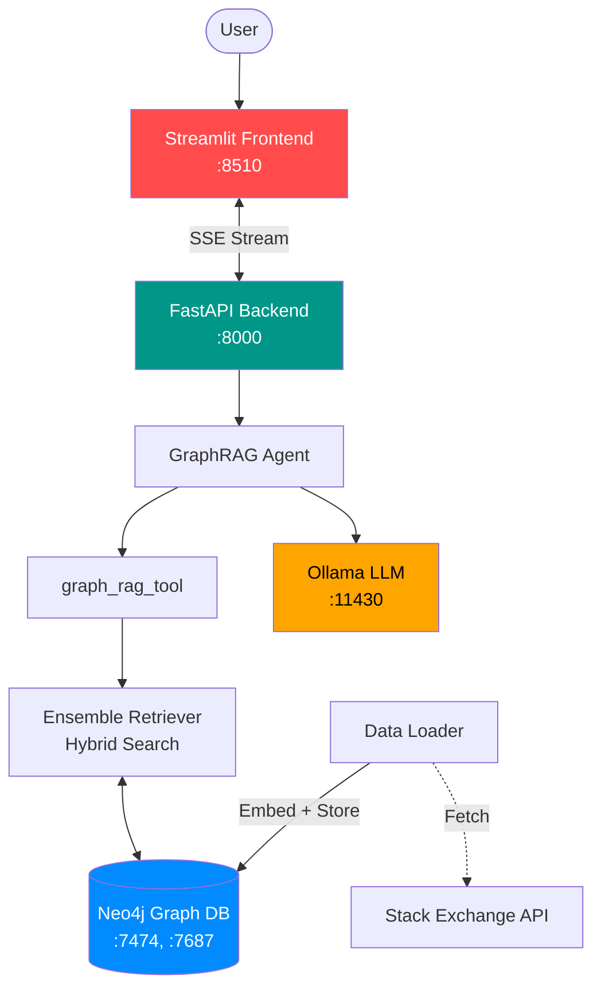

# Sanctum

> A sacred, private chamber — your personal AI knowledge sanctuary. A privacy-centric GraphRAG agent backed by a Neo4j knowledge graph and local LLMs.


---

## 🚀 Quick Start

```bash
# 1. Pull required models
ollama pull qwen3.5:4b
ollama pull snowflake-arctic-embed2

# 2. Configure environment
cp .env.example .env
# Edit .env with your Neo4j credentials

# 3. Run everything
./run.sh
```

**Access the app:** `http://localhost:8510`

---

## 📋 What It Does

Sanctum answers technical questions by:

1. **Retrieving** relevant context from a Neo4j graph (Questions, Answers, Users, Tags)
2. **Reranking** results for relevance
3. **Generating** detailed answers with visible reasoning

Data is sourced from the **Stack Exchange API** and embedded locally—nothing leaves your machine.

---

## 🏗️ Architecture



### Components

| Service                | Port       | Description                                   |
| ---------------------- | ---------- | --------------------------------------------- |
| **Streamlit Frontend** | 8510       | Multi-chat UI with graph explorer & dashboard |
| **FastAPI Backend**    | 8000       | Agent orchestration, streaming, ingestion     |
| **Neo4j**              | 7474, 7687 | Knowledge graph with vector indexes           |
| **Ollama**             | 11430      | Local LLM inference                           |

---

## 🧠 Models Used

| Model                     | Purpose                    | Context |
| ------------------------- | -------------------------- | ------- |
| `qwen3.5:4b`              | Main chat & reasoning      | 128K    |
| `qwen3.5:0.8b`            | Chat history summarization | 40K     |
| `snowflake-arctic-embed2` | Embeddings                 | 8K      |
| `BAAI/bge-reranker-base`  | Document reranking         | -       |

---

## ✨ Features

### Core
- **GraphRAG Pipeline** — Hybrid search across Question, Answer, User, and Tag nodes
- **Streaming Responses** — Real-time token-by-token generation
- **Visible Reasoning** — Agent thoughts displayed in expandable sections
- **Multi-Chat Support** — Independent sessions with persistent history

### Data & Visualization
- **StackExchange Loader** — Import by tag or top-voted questions from any SE site
- **Graph Explorer** — Interactive Neo4j visualization
- **Analytics Dashboard** — Import history & database statistics

### Privacy
- **100% Local** — All models run via Ollama
- **No External Calls** — Except Stack Exchange API for imports

---

## 🛠️ Tech Stack

```
Backend:  FastAPI, LangChain, Uvicorn, Neo4j
Frontend: Streamlit, Mermaid
LLM:      Ollama (qwen3.5, snowflake-arctic-embed2)
Infra:    Docker Compose, Neo4j (APOC + GDS plugins)
```

---

## 📦 Project Structure

```
.
├── backend/
│   ├── agent/              # LangChain agent & middleware
│   ├── app/
│   │   └── backend.py      # FastAPI server & endpoints
│   ├── tools/              # graph_rag_tool implementation
│   ├── utils/              # DB functions, memory management
│   └── setup/              # Model & graph initialization
│
├── frontend/
│   ├── web.py              # Main chat interface
│   ├── pages/
│   │   ├── loader.py       # Data ingestion UI
│   │   ├── neo4j_explorer.py
│   │   └── dashboard.py
│   └── utils/
│
├── docker-compose.yml      # Service orchestration
├── pyproject.toml          # Python dependencies
└── run.sh                  # Dev launcher
```

---

## ⚙️ Configuration

### Environment Variables

Create a `.env` file (see `.env.example`):

```bash
# Neo4j
NEO4J_URL=bolt://localhost:7687
NEO4J_USERNAME=neo4j
NEO4J_PASSWORD=your_password_here

# Ollama
OLLAMA_BASE_URL=http://localhost:11434
EMBEDDING_MODEL=snowflake-arctic-embed2

# Stack Exchange API (optional, for higher rate limits)
STACKEXCHANGE_API_KEY=your_key_here
```

### Ollama Setup

```bash
# Required models
ollama pull qwen3.5:4b
ollama pull snowflake-arctic-embed2

# Optional (for summarization)
ollama pull qwen3.5:0.8b
```

---

## 🎯 API Endpoints

### System
| Endpoint  | Method | Description                            |
| --------- | ------ | -------------------------------------- |
| `/`       | GET    | API status                             |
| `/health` | GET    | Health check                           |
| `/config` | GET    | Runtime configuration (model, DB info) |

### Chat & Agent
| Endpoint             | Method | Description                  |
| -------------------- | ------ | ---------------------------- |
| `/agent/ask`         | POST   | Stream agent responses (SSE) |
| `/chat/{session_id}` | GET    | Fetch chat message history   |
| `/chat/{session_id}` | DELETE | Delete a chat session        |

### Users
| Endpoint                | Method | Description                      |
| ----------------------- | ------ | -------------------------------- |
| `/users`                | GET    | List all users                   |
| `/user/{user_id}/chats` | GET    | List sessions for a user         |
| `/user/{user_id}`       | DELETE | Delete a user and all their data |

### Data Ingestion
| Endpoint                     | Method | Description                |
| ---------------------------- | ------ | -------------------------- |
| `/ingest`                    | POST   | Import StackExchange data  |
| `/ingest/record`             | POST   | Create an import log entry |
| `/ingest/record/{import_id}` | PUT    | Update an import log entry |
| `/ingest/record/{import_id}` | DELETE | Delete an import log entry |

### Analytics
| Endpoint               | Method | Description                    |
| ---------------------- | ------ | ------------------------------ |
| `/stats/summary`       | GET    | Database statistics            |
| `/stats/history`       | GET    | Import history                 |
| `/stats/entity_counts` | GET    | Node/entity counts             |
| `/graph/search`        | GET    | Search nodes                   |
| `/graph/sample`        | POST   | Graph sample for visualization |

### Admin
| Endpoint           | Method | Description                                        |
| ------------------ | ------ | -------------------------------------------------- |
| `/repair-sessions` | POST   | Repair sessions with missing message relationships |

---

## 🔍 How GraphRAG Works

### 1. Data Ingestion
```
Stack Exchange API → Embed (snowflake-arctic-embed2) → Neo4j
```
Questions, answers, users, and tags are stored as nodes with relationships:
- `(:User)-[:ASKED]->(:Question)`
- `(:Question)<-[:ANSWERS]-(:Answer)`
- `(:Question)-[:TAGGED]->(:Tag)`
- `(:Answer)<-[:PROVIDED]-(:User)`

### 2. Retrieval
```
User Question → Embed → Hybrid Search (Vector + BM25) → Rerank → Context
```
- **4 vector indexes** (Question, Answer, User, Tag)
- **EnsembleRetriever** combines results
- **Cross-encoder reranking** for relevance

### 3. Generation
```
Context + Prompt → qwen3.5:4b → Streamed Response
```
Agent prompted to:
1. Think step-by-step (captured separately)
2. Generate Mermaid diagrams when helpful
3. Provide technically precise answers

---

## 🐳 Docker Deployment

```bash
docker compose up -d
```

**Services:**
- `ollama` — LLM inference with GPU passthrough
- `graphDB` — Neo4j with APOC & GDS plugins
- `backend-server` — FastAPI with NVIDIA GPU access
- `frontend` — Streamlit UI

**Volumes:**
- `ollama_data` — Persistent model storage
- `neo4j_stackexchange_data` — Graph database

---

## 📊 Neo4j Schema

### Node Labels
- `Question` — title, body, score, creation_date, embedding
- `Answer` — body, score, is_accepted, embedding
- `User` — display_name, reputation
- `Tag` — name
- `Session` — chat session metadata
- `Message` — conversation history
- `ImportLog` — ingestion tracking (includes site, tags, page count)

### Relationships
```
(User)-[:ASKED]->(Question)
(Question)<-[:ANSWERS]-(Answer)
(Question)-[:TAGGED]->(Tag)
(Answer)<-[:PROVIDED]-(User)
(Session)-[:HAS_MESSAGE]->(Message)
```

---

## 🧪 Development

### Run Backend (dev)
```bash
cd backend
python -m app.backend
```

### Run Frontend (dev)
```bash
cd frontend
streamlit run web.py
```

### Run Tests
```bash
pytest
```

---

## 🤝 Contributing

1. Fork the repo
2. Create a feature branch
3. Make your changes
4. Submit a PR

---

## 📝 License

MIT License — see LICENSE for details.

---

## 🙏 Acknowledgments

- **Stack Exchange** — Data API
- **Neo4j** — Graph database
- **Ollama** — Local LLM runtime
- **LangChain** — Agent framework
- **Streamlit** — Rapid UI development
- **Docker** — Containerisation & orchestration via Docker Compose

---

**Built with ❤️ using local LLMs — your knowledge stays yours.**
